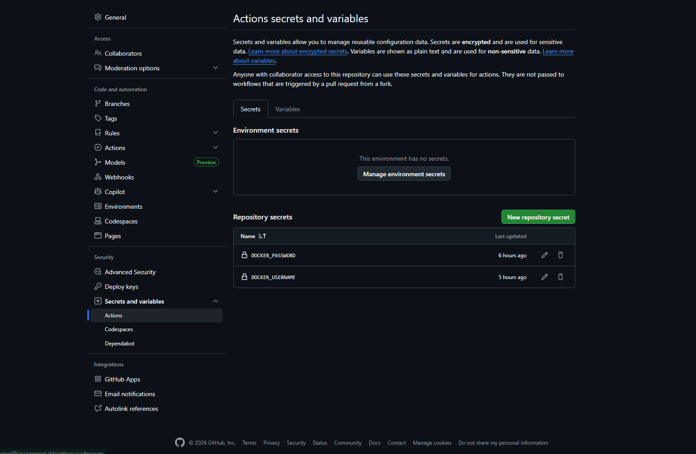
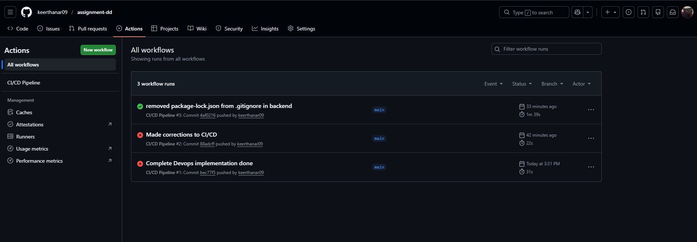
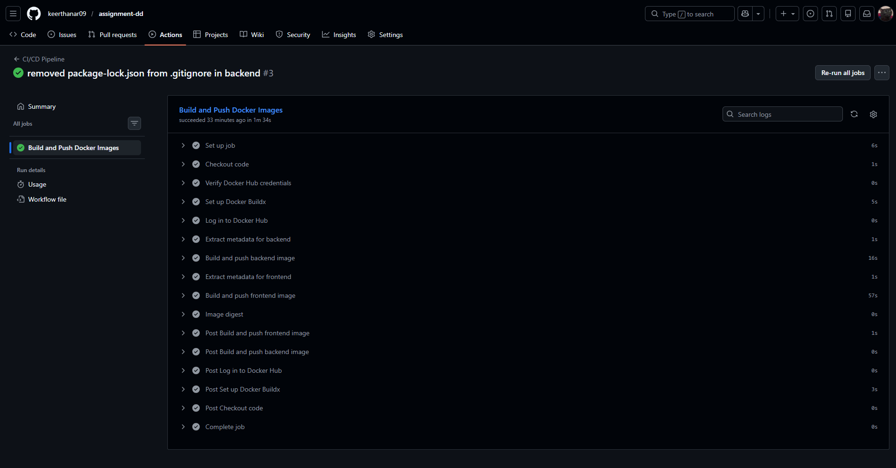
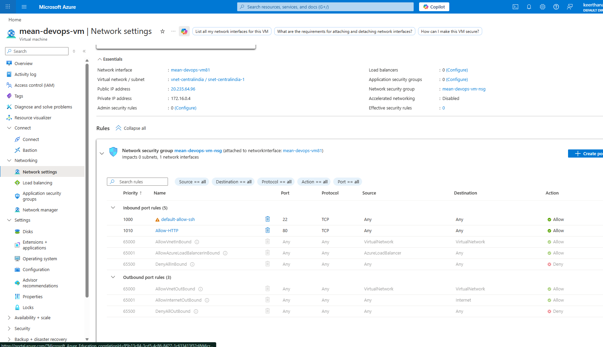
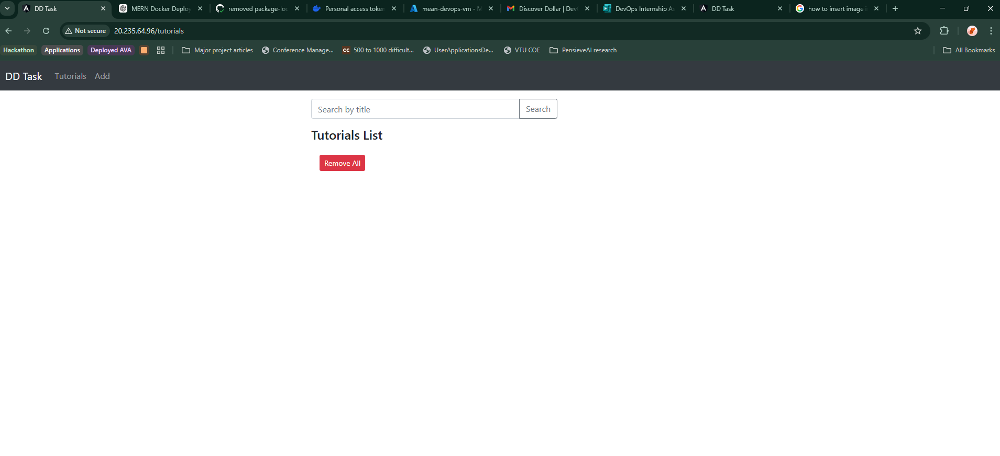
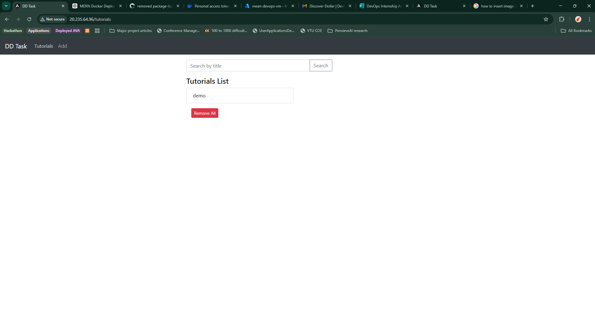
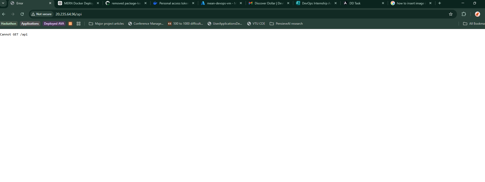
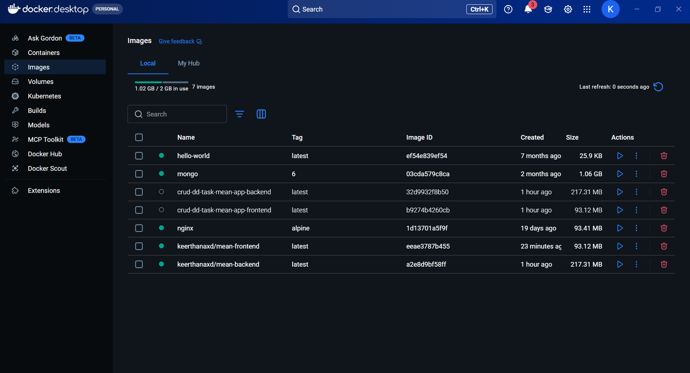
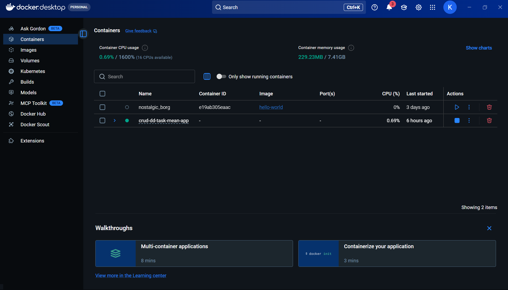

# MEAN Stack Application - DevOps Setup

Full-stack MEAN (MongoDB, Express, Angular, Node.js) application with Docker containerization, CI/CD pipeline, and Nginx reverse proxy.

## Architecture

```
Internet (Port 80)
    ↓
Nginx Reverse Proxy
    ├─→ / → Frontend (Angular)
    └─→ /api → Backend (Node.js + Express)
              ↓
          MongoDB
```

## Prerequisites

- Docker and Docker Compose
- Docker Hub account
- GitHub account
- Azure VM (Ubuntu 22.04) with ports 22 and 80 open

## Local Setup

### 1. Clone Repository
```bash
git clone <repository-url>
cd assignment-dd
```

### 2. Configure Environment
```bash
cp .env.example .env
# Edit .env and set DOCKER_USERNAME=<Your docker username>
```

### 3. Build and Run
```bash
docker compose up -d --build
```

### 4. Verify
```bash
docker compose ps
curl http://localhost/health
```

Access application at: http://localhost

## CI/CD Pipeline Setup

### 1. Configure GitHub Secrets
Navigate to: `Repository → Settings → Secrets and variables → Actions`

Add two secrets:
- `DOCKER_USERNAME`: <Your-docker-hub-username>
- `DOCKER_PASSWORD`: Your Docker Hub access token


```

### 2. Trigger Pipeline
```bash
git add .
git commit -m "Deploy application"
git push origin main
```

### 3. Monitor Workflow
Navigate to: `Repository → Actions`





The workflow automatically:
- Builds backend and frontend Docker images
- Pushes images to Docker Hub (your-username/mean-backend, your-username/mean-frontend)
- Tags with `latest` and `main-<commit-sha>`

## Azure VM Deployment

### 1. SSH to VM
```bash
ssh azureuser@<vm-public-ip>
```

### 2. Clone and Configure
```bash
mkdir -p ~/mean-app && cd ~/mean-app
git clone <repository-url> .
echo "DOCKER_USERNAME=your-docker-hub-username" > .env
```

### 3. Deploy
```bash
docker-compose pull
docker-compose up -d
```

### 4. Verify
```bash
docker-compose ps
curl http://localhost/health
```

### 5. Configure Azure NSG
In Azure Portal:
- Navigate to VM → Networking → Inbound port rules
- Add rule: Port 80, Protocol TCP, Action Allow



### 6. Access Application
Open browser: `http://<vm-public-ip>`







## Nginx Reverse Proxy

Configuration file: `nginx/nginx.conf`

Routes:
- `/` → Frontend service (port 80)
- `/api` → Backend service (port 8080)
- `/health` → Health check endpoint


## Docker Images

- Backend: `your-docker-username/mean-backend:latest`
- Frontend: `your-docker-username/mean-frontend:latest`



## Infrastructure Details

### Services
- **MongoDB**: Official mongo:6 image with persistent volume
- **Backend**: Node.js 18 Alpine, Express API
- **Frontend**: Angular 15, multi-stage build with Nginx
- **Nginx**: Alpine-based reverse proxy

### Health Checks
- MongoDB: Database ping every 10s
- Backend: HTTP check on port 8080 every 10s
- Nginx: Health endpoint check every 10s

### Volumes
- `mongodb_data`: Persistent MongoDB storage

### Network
- `mean-network`: Bridge network for service communication



## Common Commands

### Local Development
```bash
docker compose up -d          # Start services
docker compose down           # Stop services
docker compose logs -f        # View logs
docker compose ps             # Check status
```

### VM Deployment
```bash
docker-compose pull           # Pull latest images
docker-compose up -d          # Start/update services
docker-compose ps             # Check status
docker-compose logs -f        # View logs
```

## Troubleshooting

### Port 80 in use
```bash
sudo lsof -i :80
sudo systemctl stop apache2
```

### Check logs
```bash
docker compose logs backend
docker compose logs nginx
```

### Restart service
```bash
docker compose restart backend
```

## Technology Stack

- **Frontend**: Angular 15, Bootstrap 4, Nginx
- **Backend**: Node.js 18, Express.js, Mongoose
- **Database**: MongoDB 6
- **Containerization**: Docker, Docker Compose
- **CI/CD**: GitHub Actions
- **Registry**: Docker Hub
- **Reverse Proxy**: Nginx Alpine
- **Cloud**: Azure VM (Ubuntu 22.04)

## Project Structure

```
.
├── .github/workflows/
│   └── ci-cd.yml              # GitHub Actions pipeline
├── backend/
│   ├── app/                   # Express application
│   ├── Dockerfile             # Backend container
│   └── server.js              # Entry point
├── frontend/
│   ├── src/                   # Angular application
│   ├── Dockerfile             # Multi-stage frontend build
│   └── nginx.conf             # Frontend Nginx config
├── nginx/
│   └── nginx.conf             # Reverse proxy config
├── docker-compose.yml         # Service orchestration
└── .env.example               # Environment template
```

